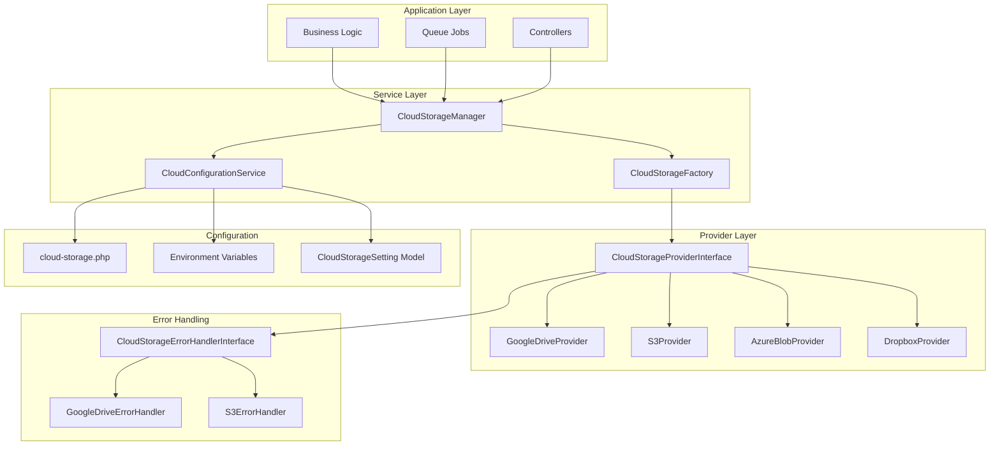

# Design Document

## Overview

This design enhances the existing cloud storage system to be truly generic and extensible for multiple providers including Amazon S3, Azure Blob Storage, and others. The current system has good foundational interfaces but lacks proper provider factory patterns, dynamic provider resolution, and comprehensive configuration management.

The design introduces a centralized provider factory system, enhanced configuration management, and improved abstraction layers while maintaining backward compatibility with the existing Google Drive implementation.

## Architecture

### High-Level Architecture



### Core Components

#### 1. CloudStorageManager
Central service that coordinates all cloud storage operations and provider management.

#### 2. CloudStorageFactory
Factory service responsible for instantiating and configuring cloud storage providers.

#### 3. CloudConfigurationService
Service for managing provider configurations from multiple sources (environment, database, config files).

#### 4. Enhanced Provider Interface
Extended interface that supports capability detection and provider-specific features.

## Components and Interfaces

### Enhanced CloudStorageProviderInterface

```php
interface CloudStorageProviderInterface
{
    // Existing methods remain unchanged for backward compatibility
    public function uploadFile(User $user, string $localPath, string $targetPath, array $metadata = []): string;
    public function deleteFile(User $user, string $fileId): bool;
    public function getConnectionHealth(User $user): CloudStorageHealthStatus;
    public function handleAuthCallback(User $user, string $code): void;
    public function getAuthUrl(User $user): string;
    public function disconnect(User $user): void;
    public function getProviderName(): string;
    public function hasValidConnection(User $user): bool;
    
    // New methods for enhanced functionality
    public function getCapabilities(): array;
    public function validateConfiguration(array $config): array;
    public function initialize(array $config): void;
    public function getAuthenticationType(): string; // 'oauth', 'api_key', 'service_account'
    public function getStorageModel(): string; // 'hierarchical', 'flat', 'hybrid'
    public function getMaxFileSize(): int;
    public function getSupportedFileTypes(): array;
    public function supportsFeature(string $feature): bool;
    public function cleanup(): void;
}
```

### CloudStorageManager

```php
class CloudStorageManager
{
    public function __construct(
        private CloudStorageFactory $factory,
        private CloudConfigurationService $configService
    ) {}
    
    public function getProvider(string $providerName = null, User $user = null): CloudStorageProviderInterface;
    public function getDefaultProvider(): CloudStorageProviderInterface;
    public function getUserProvider(User $user): CloudStorageProviderInterface;
    public function getAllProviders(): array;
    public function getAvailableProviders(): array;
    public function validateAllProviders(): array;
    public function getProviderCapabilities(string $providerName): array;
    public function switchUserProvider(User $user, string $providerName): void;
}
```

### CloudStorageFactory

```php
class CloudStorageFactory
{
    public function create(string $providerName, array $config = []): CloudStorageProviderInterface;
    public function createForUser(User $user, string $providerName = null): CloudStorageProviderInterface;
    public function register(string $name, string $className): void;
    public function getRegisteredProviders(): array;
    public function validateProvider(string $className): bool;
    public function discoverProviders(): array;
}
```

### CloudConfigurationService

```php
class CloudConfigurationService
{
    public function getProviderConfig(string $providerName): array;
    public function validateProviderConfig(string $providerName, array $config): array;
    public function getEffectiveConfig(string $providerName): array;
    public function setProviderConfig(string $providerName, array $config): void;
    public function getConfigSource(string $providerName, string $key): string; // 'environment', 'database', 'config'
    public function getAllProviderConfigs(): array;
    public function isProviderConfigured(string $providerName): bool;
}
```

### Provider Registration System

```php
class CloudStorageServiceProvider extends ServiceProvider
{
    public function register(): void
    {
        $this->registerCoreServices();
        $this->registerProviders();
        $this->registerErrorHandlers();
    }
    
    private function registerProviders(): void
    {
        $factory = $this->app->make(CloudStorageFactory::class);
        
        // Auto-discover providers
        $providers = $this->discoverProviders();
        foreach ($providers as $name => $className) {
            $factory->register($name, $className);
        }
        
        // Register specific providers
        $factory->register('google-drive', GoogleDriveProvider::class);
        $factory->register('amazon-s3', S3Provider::class);
        $factory->register('azure-blob', AzureBlobProvider::class);
        $factory->register('dropbox', DropboxProvider::class);
    }
}
```

## Data Models

### Enhanced CloudStorageSetting Model

The existing model will be extended to support provider-specific configuration schemas:

```php
class CloudStorageSetting extends Model
{
    // Existing methods remain unchanged
    
    // New methods for enhanced functionality
    public static function getProviderSchema(string $provider): array;
    public static function validateProviderConfig(string $provider, array $config): array;
    public static function getRequiredKeys(string $provider): array;
    public static function getOptionalKeys(string $provider): array;
    public static function getEncryptedKeys(string $provider): array;
    public static function migrateFromEnvironment(string $provider): void;
}
```

### Provider Configuration Schema

```php
// config/cloud-storage.php enhancement
return [
    'default' => env('CLOUD_STORAGE_DEFAULT', 'google-drive'),
    
    'providers' => [
        'google-drive' => [
            'driver' => 'google-drive',
            'class' => GoogleDriveProvider::class,
            'error_handler' => GoogleDriveErrorHandler::class,
            'auth_type' => 'oauth',
            'storage_model' => 'hierarchical',
            'config' => [
                'client_id' => env('GOOGLE_DRIVE_CLIENT_ID'),
                'client_secret' => env('GOOGLE_DRIVE_CLIENT_SECRET'),
                'redirect_uri' => config('app.url') . '/admin/cloud-storage/google-drive/callback',
            ],
            'features' => [
                'folder_creation' => true,
                'file_upload' => true,
                'file_delete' => true,
                'folder_delete' => true,
                'max_file_size' => 5368709120, // 5GB
                'supported_file_types' => ['*'], // All types
            ],
        ],
        
        'amazon-s3' => [
            'driver' => 'amazon-s3',
            'class' => S3Provider::class,
            'error_handler' => S3ErrorHandler::class,
            'auth_type' => 'api_key',
            'storage_model' => 'flat',
            'config' => [
                'access_key_id' => env('AWS_ACCESS_KEY_ID'),
                'secret_access_key' => env('AWS_SECRET_ACCESS_KEY'),
                'region' => env('AWS_DEFAULT_REGION', 'us-east-1'),
                'bucket' => env('AWS_BUCKET'),
                'endpoint' => env('AWS_ENDPOINT'),
            ],
            'features' => [
                'folder_creation' => false, // S3 uses key prefixes
                'file_upload' => true,
                'file_delete' => true,
                'folder_delete' => false,
                'max_file_size' => 5497558138880, // 5TB
                'supported_file_types' => ['*'],
                'presigned_urls' => true,
                'storage_classes' => ['STANDARD', 'IA', 'GLACIER'],
            ],
        ],
        
        'azure-blob' => [
            'driver' => 'azure-blob',
            'class' => AzureBlobProvider::class,
            'error_handler' => AzureBlobErrorHandler::class,
            'auth_type' => 'connection_string',
            'storage_model' => 'flat',
            'config' => [
                'connection_string' => env('AZURE_STORAGE_CONNECTION_STRING'),
                'container' => env('AZURE_STORAGE_CONTAINER'),
            ],
            'features' => [
                'folder_creation' => false,
                'file_upload' => true,
                'file_delete' => true,
                'folder_delete' => false,
                'max_file_size' => 4398046511104, // 4TB
                'supported_file_types' => ['*'],
                'access_tiers' => ['Hot', 'Cool', 'Archive'],
            ],
        ],
    ],
    
    'feature_detection' => [
        'required_features' => ['file_upload', 'file_delete'],
        'optional_features' => ['folder_creation', 'folder_delete', 'presigned_urls'],
    ],
    
    'fallback' => [
        'enabled' => true,
        'order' => ['google-drive', 'amazon-s3', 'azure-blob'],
    ],
];
```

## Error Handling

### Enhanced Error Classification

The existing `CloudStorageErrorType` enum will be extended to support provider-specific error types:

```php
enum CloudStorageErrorType: string
{
    // Existing error types remain unchanged
    
    // New S3-specific error types
    case BUCKET_NOT_FOUND = 'bucket_not_found';
    case INVALID_BUCKET_NAME = 'invalid_bucket_name';
    case BUCKET_ACCESS_DENIED = 'bucket_access_denied';
    case INVALID_REGION = 'invalid_region';
    case STORAGE_CLASS_NOT_SUPPORTED = 'storage_class_not_supported';
    
    // New Azure-specific error types
    case CONTAINER_NOT_FOUND = 'container_not_found';
    case INVALID_CONNECTION_STRING = 'invalid_connection_string';
    case BLOB_ACCESS_DENIED = 'blob_access_denied';
    
    // Generic provider error types
    case PROVIDER_NOT_CONFIGURED = 'provider_not_configured';
    case PROVIDER_INITIALIZATION_FAILED = 'provider_initialization_failed';
    case FEATURE_NOT_SUPPORTED = 'feature_not_supported';
}
```

### Provider-Specific Error Handlers

Each provider will have its own error handler that implements the `CloudStorageErrorHandlerInterface`:

```php
class S3ErrorHandler implements CloudStorageErrorHandlerInterface
{
    public function classifyError(Exception $exception): CloudStorageErrorType
    {
        // S3-specific error classification logic
        if ($exception instanceof S3Exception) {
            return match ($exception->getAwsErrorCode()) {
                'NoSuchBucket' => CloudStorageErrorType::BUCKET_NOT_FOUND,
                'InvalidBucketName' => CloudStorageErrorType::INVALID_BUCKET_NAME,
                'AccessDenied' => CloudStorageErrorType::BUCKET_ACCESS_DENIED,
                'InvalidRegion' => CloudStorageErrorType::INVALID_REGION,
                default => CloudStorageErrorType::UNKNOWN_ERROR,
            };
        }
        
        return parent::classifyError($exception);
    }
}
```

## Testing Strategy

### Base Test Classes

```php
abstract class CloudStorageProviderTestCase extends TestCase
{
    abstract protected function getProviderName(): string;
    abstract protected function createProvider(): CloudStorageProviderInterface;
    
    public function test_implements_interface(): void
    {
        $provider = $this->createProvider();
        $this->assertInstanceOf(CloudStorageProviderInterface::class, $provider);
    }
    
    public function test_has_valid_provider_name(): void
    {
        $provider = $this->createProvider();
        $this->assertNotEmpty($provider->getProviderName());
        $this->assertEquals($this->getProviderName(), $provider->getProviderName());
    }
    
    // Common test methods for all providers
}

class GoogleDriveProviderTest extends CloudStorageProviderTestCase
{
    protected function getProviderName(): string
    {
        return 'google-drive';
    }
    
    protected function createProvider(): CloudStorageProviderInterface
    {
        return new GoogleDriveProvider(/* dependencies */);
    }
}

class S3ProviderTest extends CloudStorageProviderTestCase
{
    protected function getProviderName(): string
    {
        return 'amazon-s3';
    }
    
    protected function createProvider(): CloudStorageProviderInterface
    {
        return new S3Provider(/* dependencies */);
    }
}
```

### Integration Testing

```php
class CloudStorageIntegrationTest extends TestCase
{
    public function test_can_switch_between_providers(): void
    {
        $manager = app(CloudStorageManager::class);
        $user = User::factory()->create();
        
        // Test Google Drive
        $gdProvider = $manager->getProvider('google-drive');
        $this->assertEquals('google-drive', $gdProvider->getProviderName());
        
        // Test S3
        $s3Provider = $manager->getProvider('amazon-s3');
        $this->assertEquals('amazon-s3', $s3Provider->getProviderName());
        
        // Test user-specific provider
        $manager->switchUserProvider($user, 'amazon-s3');
        $userProvider = $manager->getUserProvider($user);
        $this->assertEquals('amazon-s3', $userProvider->getProviderName());
    }
}
```

## Migration Strategy

### Phase 1: Core Infrastructure
1. Create enhanced interfaces and base classes
2. Implement CloudStorageManager and CloudStorageFactory
3. Create CloudConfigurationService
4. Set up provider registration system

### Phase 2: Provider Implementation
1. Refactor existing GoogleDriveProvider to use new interfaces
2. Implement S3Provider as proof of concept
3. Create provider-specific error handlers
4. Update configuration system

### Phase 3: Integration and Testing
1. Update existing services to use CloudStorageManager
2. Migrate existing jobs and controllers
3. Implement comprehensive test suite
4. Update documentation

### Phase 4: Advanced Features
1. Implement capability detection
2. Add provider fallback mechanisms
3. Create admin interface for provider management
4. Implement monitoring and health checks

## Backward Compatibility

### Deprecation Strategy

```php
// Existing GoogleDriveService will be marked as deprecated
class GoogleDriveService
{
    public function __construct()
    {
        if (config('app.debug')) {
            Log::warning('GoogleDriveService is deprecated. Use CloudStorageManager instead.');
        }
    }
    
    // Existing methods will delegate to new system
    public function uploadFile(/* parameters */)
    {
        $manager = app(CloudStorageManager::class);
        $provider = $manager->getProvider('google-drive');
        return $provider->uploadFile(/* parameters */);
    }
}
```

### Service Container Bindings

```php
// Maintain backward compatibility
$this->app->bind(GoogleDriveService::class, function ($app) {
    return new DeprecatedGoogleDriveServiceWrapper(
        $app->make(CloudStorageManager::class)
    );
});

// New bindings
$this->app->singleton(CloudStorageManager::class);
$this->app->singleton(CloudStorageFactory::class);
$this->app->singleton(CloudConfigurationService::class);
```

## Performance Considerations

### Provider Caching
- Cache provider instances to avoid repeated instantiation
- Cache configuration validation results
- Implement connection pooling where applicable

### Lazy Loading
- Load providers only when needed
- Defer configuration validation until provider is used
- Implement lazy loading for provider discovery

### Resource Management
- Proper cleanup of provider resources
- Connection timeout handling
- Memory usage optimization for large file operations

## Security Considerations

### Configuration Security
- Encrypt sensitive configuration values in database
- Validate configuration inputs to prevent injection attacks
- Implement secure credential storage and rotation

### Provider Security
- Validate provider implementations for security compliance
- Implement secure authentication flows for each provider type
- Audit provider access and operations

### Access Control
- Implement provider-level access controls
- Validate user permissions for provider operations
- Log all provider access and configuration changes

This design provides a comprehensive foundation for a truly generic cloud storage system that can easily accommodate new providers while maintaining backward compatibility and providing enhanced functionality.