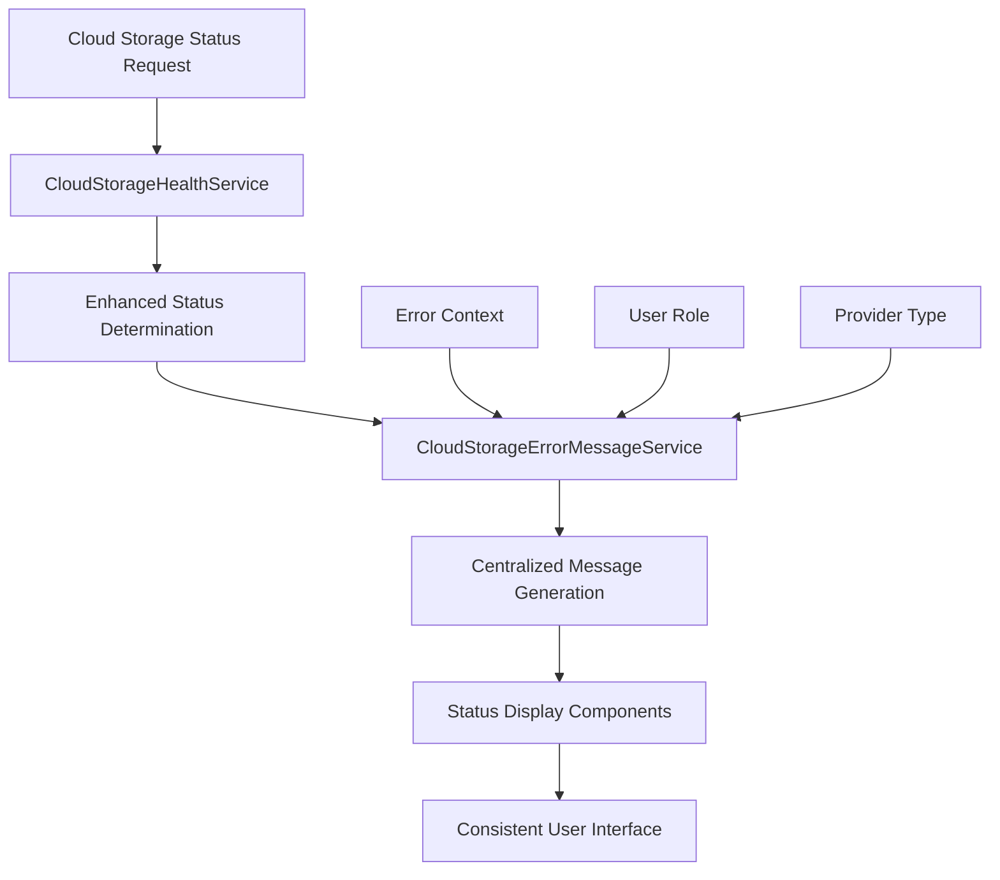

# Design Document

## Overview

This design addresses the cleanup of redundant and confusing cloud storage status messaging by centralizing error message generation, eliminating duplicate status displays, and providing clear, actionable user feedback. The solution leverages the existing `CloudStorageErrorMessageService` and enhances the status display logic to provide consistent, user-friendly messaging across the application.

## Architecture

### Current State Analysis

The current system has several messaging issues:

1. **Generic Messages**: The `CloudStorageHealthService` returns generic "Connection issues detected - please check your network and try again" messages
2. **Redundant Information**: Status badges show "Connected" while health status shows "Connection issues"
3. **Inconsistent Messaging**: Different parts of the application show different messages for the same errors
4. **Poor User Experience**: Users see technical jargon instead of actionable guidance

### Proposed Architecture



## Components and Interfaces

### 1. Enhanced CloudStorageHealthService

**Purpose**: Provide detailed error context to the message service instead of generating generic messages.

**Key Changes**:
- Remove generic message generation
- Provide structured error context
- Include specific error types and details

```php
class CloudStorageHealthService
{
    public function getProviderHealthWithContext(User $user, string $provider): array
    {
        $healthStatus = $this->getProviderHealth($user, $provider);
        
        return [
            'status' => $healthStatus->getStatus(),
            'consolidated_status' => $healthStatus->getConsolidatedStatus(),
            'error_context' => [
                'error_type' => $healthStatus->getLastErrorType(),
                'error_details' => $healthStatus->getLastErrorMessage(),
                'consecutive_failures' => $healthStatus->getConsecutiveFailures(),
                'token_status' => $healthStatus->getTokenStatus(),
                'provider' => $provider,
                'user' => $user
            ]
        ];
    }
}
```

### 2. Enhanced CloudStorageErrorMessageService

**Purpose**: Generate consistent, actionable messages based on specific error contexts.

**Key Enhancements**:
- Add token refresh rate limiting messages
- Improve message specificity
- Add context-aware message generation

```php
class CloudStorageErrorMessageService
{
    public function getStatusDisplayMessage(string $consolidatedStatus, array $context = []): string
    {
        // Handle specific error contexts first
        if (isset($context['error_type'])) {
            return $this->getActionableErrorMessage(
                CloudStorageErrorType::from($context['error_type']), 
                $context
            );
        }
        
        // Handle consolidated status
        return match ($consolidatedStatus) {
            'healthy' => 'Connected and working properly',
            'authentication_required' => 'Authentication required. Please reconnect your account.',
            'connection_issues' => $this->getConnectionIssueMessage($context),
            'not_connected' => 'Account not connected. Please set up your cloud storage connection.',
            default => 'Status unknown. Please refresh or contact support.'
        };
    }
    
    private function getConnectionIssueMessage(array $context): string
    {
        $consecutiveFailures = $context['consecutive_failures'] ?? 0;
        $errorType = $context['error_type'] ?? null;
        
        // Handle specific connection issues
        if ($errorType === 'token_refresh_rate_limited') {
            return 'Too many token refresh attempts. Please try again later.';
        }
        
        if ($consecutiveFailures > 3) {
            return 'Multiple connection failures detected. Please check your account settings.';
        }
        
        return 'Connection issue detected. Please test your connection.';
    }
}
```

### 3. Status Display Component Refactoring

**Purpose**: Eliminate redundant messaging and provide consistent status display.

**Key Changes**:
- Single source of truth for status messages
- Remove contradictory status indicators
- Streamline status display logic

```php
// In cloud-storage-status-widget.blade.php
@php
    $statusData = $healthService->getProviderHealthWithContext($user, $provider);
    $displayMessage = $errorMessageService->getStatusDisplayMessage(
        $statusData['consolidated_status'], 
        $statusData['error_context']
    );
@endphp
```

### 4. Centralized Message Configuration

**Purpose**: Allow easy maintenance and updates of status messages.

```php
class CloudStorageStatusMessages
{
    public const RATE_LIMITED_MESSAGE = 'Too many token refresh attempts. Please try again later.';
    public const AUTH_REQUIRED_MESSAGE = 'Authentication required. Please reconnect your account.';
    public const CONNECTION_HEALTHY_MESSAGE = 'Connected and working properly';
    
    public static function getRetryTimeMessage(int $retryAfterSeconds): string
    {
        $minutes = ceil($retryAfterSeconds / 60);
        return "Too many attempts. Please try again in {$minutes} minute" . ($minutes === 1 ? '' : 's') . ".";
    }
}
```

## Data Models

### Enhanced Error Context Structure

```php
interface ErrorContext
{
    public function getErrorType(): ?CloudStorageErrorType;
    public function getErrorDetails(): ?string;
    public function getConsecutiveFailures(): int;
    public function getTokenStatus(): ?string;
    public function getProvider(): string;
    public function getUser(): User;
    public function getRetryAfter(): ?int;
    public function isRateLimited(): bool;
}
```

### Status Display Data Transfer Object

```php
class StatusDisplayData
{
    public function __construct(
        public readonly string $status,
        public readonly string $consolidatedStatus,
        public readonly string $displayMessage,
        public readonly array $actionButtons,
        public readonly bool $showTechnicalDetails,
        public readonly ?string $retryAfter = null
    ) {}
}
```

## Error Handling

### 1. Rate Limiting Detection

```php
class TokenRefreshRateLimitDetector
{
    public function isRateLimited(User $user, string $provider): bool
    {
        $recentAttempts = GoogleDriveToken::where('user_id', $user->id)
            ->where('created_at', '>', now()->subHour())
            ->count();
            
        return $recentAttempts >= config('cloud-storage.token_refresh_limit', 5);
    }
    
    public function getRetryAfter(User $user, string $provider): ?int
    {
        $oldestAttempt = GoogleDriveToken::where('user_id', $user->id)
            ->where('created_at', '>', now()->subHour())
            ->oldest()
            ->first();
            
        if (!$oldestAttempt) {
            return null;
        }
        
        return max(0, 3600 - $oldestAttempt->created_at->diffInSeconds(now()));
    }
}
```

### 2. Message Priority System

```php
class MessagePriorityResolver
{
    public function resolveMessage(array $errorContexts): string
    {
        // Priority order: Rate limiting > Auth required > Connection issues > Generic
        foreach ($errorContexts as $context) {
            if ($context['is_rate_limited']) {
                return CloudStorageStatusMessages::RATE_LIMITED_MESSAGE;
            }
        }
        
        foreach ($errorContexts as $context) {
            if ($context['consolidated_status'] === 'authentication_required') {
                return CloudStorageStatusMessages::AUTH_REQUIRED_MESSAGE;
            }
        }
        
        // Continue with other priorities...
    }
}
```

## Testing Strategy

### 1. Unit Tests

```php
class CloudStorageStatusMessagingTest extends TestCase
{
    public function test_rate_limited_message_takes_priority()
    {
        $context = [
            'error_type' => 'token_refresh_rate_limited',
            'is_rate_limited' => true,
            'consecutive_failures' => 5
        ];
        
        $message = $this->errorMessageService->getStatusDisplayMessage('connection_issues', $context);
        
        $this->assertEquals('Too many token refresh attempts. Please try again later.', $message);
    }
    
    public function test_no_redundant_messaging()
    {
        // Test that connected status doesn't show connection issues
        $context = ['consolidated_status' => 'healthy'];
        
        $message = $this->errorMessageService->getStatusDisplayMessage('healthy', $context);
        
        $this->assertEquals('Connected and working properly', $message);
        $this->assertStringNotContainsString('Connection issues', $message);
    }
}
```

### 2. Integration Tests

```php
class StatusDisplayIntegrationTest extends TestCase
{
    public function test_consistent_messaging_across_components()
    {
        // Test that dashboard and modal show same message for same error
        $user = User::factory()->create();
        $this->simulateRateLimitedState($user);
        
        $dashboardResponse = $this->get(route('admin.cloud-storage.status'));
        $testResponse = $this->post(route('admin.cloud-storage.test', ['provider' => 'google-drive']));
        
        $this->assertStringContainsString('Too many token refresh attempts', $dashboardResponse->content());
        $this->assertStringContainsString('Too many token refresh attempts', $testResponse->json('message'));
    }
}
```

### 3. Frontend Tests

```javascript
describe('Status Display Consistency', () => {
    test('shows single clear message for rate limited state', () => {
        const provider = {
            consolidated_status: 'connection_issues',
            error_context: {
                error_type: 'token_refresh_rate_limited',
                is_rate_limited: true
            }
        };
        
        const message = getStatusDisplayMessage(provider);
        
        expect(message).toBe('Too many token refresh attempts. Please try again later.');
        expect(message).not.toContain('Connection issues detected');
    });
});
```

## Implementation Plan

### Phase 1: Backend Message Centralization
1. Enhance `CloudStorageErrorMessageService` with new message types
2. Update `CloudStorageHealthService` to provide error context
3. Create message priority resolution system
4. Add rate limiting detection logic

### Phase 2: Frontend Display Updates
1. Update status widget to use centralized messaging
2. Remove redundant status displays
3. Implement consistent error display patterns
4. Update modal components to use same messaging

### Phase 3: Testing and Validation
1. Add comprehensive unit tests
2. Create integration tests for message consistency
3. Add frontend tests for display logic
4. Perform user acceptance testing

### Phase 4: Documentation and Monitoring
1. Update API documentation
2. Create troubleshooting guides
3. Add monitoring for message consistency
4. Create maintenance procedures

## Migration Strategy

### Backward Compatibility
- Maintain existing API endpoints during transition
- Gradually migrate components to new messaging system
- Provide fallback messages for edge cases

### Rollout Plan
1. **Development**: Implement and test new messaging system
2. **Staging**: Validate message consistency across all components
3. **Production**: Gradual rollout with monitoring
4. **Cleanup**: Remove deprecated message generation code

## Monitoring and Maintenance

### Key Metrics
- Message consistency across components
- User confusion reports
- Error message effectiveness
- Rate limiting accuracy

### Maintenance Tasks
- Regular review of error message effectiveness
- Update messages based on user feedback
- Monitor for new error types requiring messages
- Validate message consistency during deployments