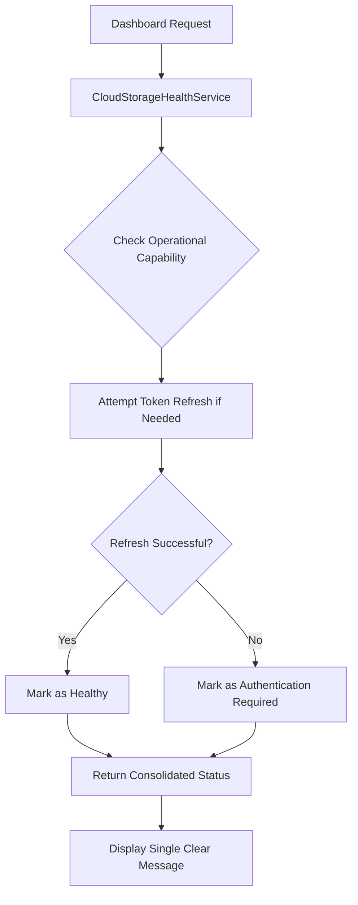

# Design Document

## Overview

This design addresses the confusing Google Drive status messaging in the dashboard where users see "Healthy" status alongside "Token refresh needed" warnings. The solution involves improving the status determination logic to prioritize operational capability over token age, implementing automatic token refresh validation, and consolidating status messages to eliminate contradictions.

## Architecture

### Current Problem Analysis

The current system has several issues:

1. **Status Determination Logic**: The `CloudStorageHealthService` checks token expiration separately from operational capability
2. **Token Refresh Handling**: Token refresh occurs reactively during API calls rather than proactively during status checks
3. **Message Inconsistency**: Multiple status indicators can show conflicting information simultaneously
4. **User Experience**: Technical details about token refresh are exposed when they should be handled transparently

### Proposed Solution Architecture



## Components and Interfaces

### Enhanced CloudStorageHealthService

The service will be modified to implement proactive token refresh during status checks:

```php
class CloudStorageHealthService
{
    /**
     * Enhanced health check that validates operational capability
     */
    public function checkConnectionHealth(User $user, string $provider): CloudStorageHealthStatus
    {
        // 1. Attempt to ensure valid token (with refresh if needed)
        // 2. Perform actual API connectivity test
        // 3. Determine status based on operational capability
        // 4. Return consolidated status
    }
    
    /**
     * New method to validate and refresh tokens proactively
     */
    public function ensureValidToken(User $user, string $provider): bool
    {
        // Attempt token refresh if needed
        // Return true if token is valid/refreshed, false if refresh failed
    }
    
    /**
     * Enhanced status determination that prioritizes operational capability
     */
    public function determineConsolidatedStatus(User $user, string $provider): array
    {
        // Return single, clear status message
        // Eliminate contradictory indicators
    }
}
```

### Enhanced GoogleDriveService Integration

The `GoogleDriveService` will be enhanced to support proactive token validation:

```php
class GoogleDriveService
{
    /**
     * New method to validate token without performing operations
     */
    public function validateAndRefreshToken(User $user): bool
    {
        // Check token validity
        // Attempt refresh if expired
        // Return success/failure status
    }
    
    /**
     * Enhanced method to test actual API connectivity
     */
    public function testApiConnectivity(User $user): bool
    {
        // Perform lightweight API call (e.g., get user info)
        // Return true if successful, false otherwise
    }
}
```

### Updated Dashboard Widget Logic

The dashboard widget will display consolidated status information:

```blade
<!-- Single status indicator instead of multiple conflicting messages -->
<div class="status-indicator">
    <div class="status-badge" :class="getStatusClass(provider.status)">
        {{ provider.consolidated_status }}
    </div>
    <div class="status-message">
        {{ provider.status_message }}
    </div>
    <!-- No separate token refresh warnings -->
</div>
```

## Data Models

### CloudStorageHealthStatus Model Updates

New fields to support consolidated status:

```php
class CloudStorageHealthStatus extends Model
{
    protected $fillable = [
        // ... existing fields ...
        'consolidated_status',           // Single status: healthy, authentication_required, connection_issues, not_connected
        'last_token_refresh_attempt_at', // Track when we last tried to refresh
        'token_refresh_failures',        // Count consecutive refresh failures
        'operational_test_result',       // Result of last API connectivity test
    ];
    
    /**
     * Get consolidated status message that eliminates confusion
     */
    public function getConsolidatedStatusMessage(): string
    {
        return match ($this->consolidated_status) {
            'healthy' => 'Connection is working properly',
            'authentication_required' => 'Please reconnect your account',
            'connection_issues' => 'Experiencing connectivity problems',
            'not_connected' => 'Account not connected',
            default => 'Status unknown',
        };
    }
    
    /**
     * Check if automatic token refresh is working
     */
    public function isTokenRefreshWorking(): bool
    {
        return $this->token_refresh_failures < 3;
    }
}
```

## Error Handling

### Token Refresh Error Scenarios

1. **Refresh Token Expired**: Mark as "authentication_required"
2. **Network Issues During Refresh**: Mark as "connection_issues" 
3. **API Quota Exceeded**: Mark as "connection_issues" with specific message
4. **Invalid Credentials**: Mark as "authentication_required"

### Status Determination Logic

```php
private function determineConsolidatedStatus(User $user, string $provider): string
{
    // 1. Try to ensure valid token
    $tokenValid = $this->ensureValidToken($user, $provider);
    
    if (!$tokenValid) {
        return 'authentication_required';
    }
    
    // 2. Test actual API connectivity
    $apiConnected = $this->testApiConnectivity($user, $provider);
    
    if (!$apiConnected) {
        return 'connection_issues';
    }
    
    // 3. If both token and API work, it's healthy
    return 'healthy';
}
```

## Testing Strategy

### Unit Tests

1. **Token Refresh Validation Tests**
   - Test successful token refresh updates status to healthy
   - Test failed token refresh marks as authentication required
   - Test network failures during refresh mark as connection issues

2. **Status Consolidation Tests**
   - Test that healthy connections don't show warning messages
   - Test that expired but refreshable tokens show as healthy
   - Test that non-refreshable expired tokens show as authentication required

3. **API Connectivity Tests**
   - Test that successful API calls mark connection as healthy
   - Test that API failures with valid tokens mark as connection issues
   - Test that authentication errors mark as authentication required

### Integration Tests

1. **End-to-End Status Flow Tests**
   - Test complete status check flow with token refresh
   - Test dashboard display consistency with backend status
   - Test "Test Connection" button results match displayed status

2. **Token Refresh Workflow Tests**
   - Test automatic token refresh during status checks
   - Test that successful refresh eliminates warning messages
   - Test that failed refresh shows appropriate reconnection prompts

### Manual Testing Scenarios

1. **Token Expiration Scenarios**
   - Manually expire access token, verify automatic refresh works
   - Manually expire refresh token, verify authentication required status
   - Verify no "token refresh needed" messages when refresh works

2. **API Connectivity Scenarios**
   - Test with network disconnection
   - Test with API quota exceeded
   - Test with invalid API credentials

## Implementation Phases

### Phase 1: Enhanced Status Determination Logic
- Modify `CloudStorageHealthService::checkConnectionHealth()` to include proactive token refresh
- Add `ensureValidToken()` method to handle token refresh during status checks
- Update status determination to prioritize operational capability

### Phase 2: GoogleDriveService Integration
- Add `validateAndRefreshToken()` method to GoogleDriveService
- Add `testApiConnectivity()` method for lightweight API testing
- Integrate with health service for proactive token management

### Phase 3: Consolidated Status Messages
- Update `CloudStorageHealthStatus` model with consolidated status fields
- Modify dashboard widget to display single, clear status messages
- Remove contradictory token refresh warnings

### Phase 4: Testing and Validation
- Implement comprehensive test suite covering all scenarios
- Perform manual testing with various token states
- Validate that refresh token mechanism works correctly throughout testing

## Migration Strategy

### Database Changes
- Add new fields to `cloud_storage_health_statuses` table
- Migrate existing status data to new consolidated format
- Preserve existing functionality during transition

### Backward Compatibility
- Maintain existing API endpoints during transition
- Ensure existing status checks continue to work
- Gradually migrate to new consolidated status approach

## Performance Considerations

### Caching Strategy
- Cache successful token refresh results for 5 minutes
- Cache API connectivity test results for 2 minutes
- Avoid excessive API calls during status checks

### Rate Limiting
- Limit token refresh attempts to prevent API quota exhaustion
- Implement exponential backoff for failed refresh attempts
- Track and limit frequency of connectivity tests

## Security Considerations

### Token Handling
- Ensure refresh tokens are never exposed in status responses
- Log token refresh attempts for audit purposes
- Implement secure storage of refreshed tokens

### Error Information
- Sanitize error messages to avoid exposing sensitive information
- Log detailed errors server-side while showing user-friendly messages
- Ensure status endpoints don't leak internal system details

## Monitoring and Observability

### Logging Strategy
- Log all token refresh attempts with outcomes
- Log status determination decisions and reasoning
- Track frequency of different status states

### Metrics
- Monitor token refresh success/failure rates
- Track time spent in different status states
- Alert on high rates of authentication failures

This design ensures that users see clear, consistent status information while the system handles OAuth token refresh transparently in the background.