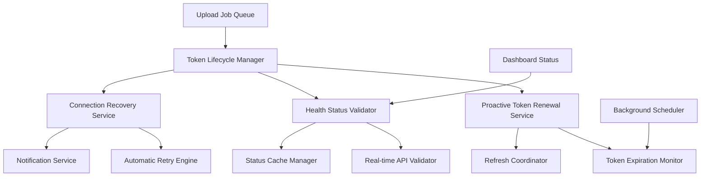

# Design Document

## Overview

This design addresses critical failures in the Google Drive token management and health status reporting system. The current implementation has two major issues:

1. **Token Auto-Renewal Failure**: Tokens expire without automatic refresh, causing uploads to fail silently
2. **Inaccurate Health Status**: Dashboard shows "healthy" status when the connection is actually broken

The solution implements a comprehensive token lifecycle management system with proactive renewal, real-time health validation, and automatic recovery mechanisms.

## Architecture

### Core Components



### Service Integration

The design integrates with existing services while adding new capabilities:

- **GoogleDriveService**: Enhanced with proactive token validation
- **CloudStorageHealthService**: Real-time status determination
- **UploadToGoogleDrive Job**: Automatic token refresh before operations
- **Dashboard Controllers**: Live connection validation

## Components and Interfaces

### 1. Token Lifecycle Manager

**Purpose**: Central coordinator for all token-related operations

```php
interface TokenLifecycleManagerInterface
{
    public function ensureValidToken(User $user, string $provider): TokenValidationResult;
    public function proactivelyRefreshToken(User $user, string $provider): RefreshResult;
    public function validateTokenHealth(User $user, string $provider): HealthResult;
    public function scheduleTokenMaintenance(User $user, string $provider): void;
}
```

**Key Features**:
- Coordinates token refresh across concurrent operations
- Implements mutex locking to prevent duplicate refresh attempts
- Tracks token refresh history and success rates
- Provides detailed error classification and recovery suggestions

### 2. Proactive Token Renewal Service

**Purpose**: Automatically refresh tokens before they expire

```php
class ProactiveTokenRenewalService
{
    public function refreshTokenIfNeeded(User $user, string $provider): RefreshResult;
    public function schedulePreemptiveRefresh(User $user, string $provider, Carbon $expiresAt): void;
    public function handleRefreshFailure(User $user, string $provider, Exception $error): void;
    public function notifyUserOfRefreshFailure(User $user, string $provider, TokenRefreshErrorType $error): void;
}
```

**Implementation Strategy**:
- Refresh tokens 15 minutes before expiration
- Implement exponential backoff for failed refresh attempts (1s, 2s, 4s, 8s, 16s)
- Maximum 5 retry attempts for network-related failures
- Immediate failure for invalid refresh tokens (requires re-authentication)

### 3. Real-time Health Status Validator

**Purpose**: Provide accurate, live connection status

```php
class RealTimeHealthValidator
{
    public function validateConnectionHealth(User $user, string $provider): HealthStatus;
    public function performLiveApiTest(User $user, string $provider): ApiTestResult;
    public function updateHealthCache(User $user, string $provider, HealthStatus $status): void;
}
```

**Validation Process**:
1. **Token Validation**: Check if token exists and can be refreshed
2. **API Connectivity Test**: Perform lightweight API call (Google Drive `about.get`)
3. **Operational Capability**: Verify actual upload/folder operations work
4. **Cache Management**: Store results with appropriate TTL (30s for healthy, 10s for issues)

### 4. Connection Recovery Service

**Purpose**: Automatically recover from connection issues and notify users

```php
class ConnectionRecoveryService
{
    public function attemptAutomaticRecovery(User $user, string $provider): RecoveryResult;
    public function retryPendingUploads(User $user, string $provider): void;
    public function notifyUserOfIssues(User $user, string $provider, ErrorType $error): void;
    public function sendTokenRenewalFailureNotification(User $user, string $provider, TokenRefreshErrorType $error): void;
}
```

## Data Models

### Enhanced GoogleDriveToken Model

```php
class GoogleDriveToken extends Model
{
    protected $fillable = [
        'user_id',
        'access_token',
        'refresh_token',
        'token_type',
        'expires_at',
        'scopes',
        // New fields for enhanced tracking
        'last_refresh_attempt_at',
        'refresh_failure_count',
        'last_successful_refresh_at',
        'proactive_refresh_scheduled_at',
        'health_check_failures',
        'requires_user_intervention',
        'last_notification_sent_at',
        'notification_failure_count'
    ];
    
    public function isExpiringSoon(int $minutes = 15): bool;
    public function canBeRefreshed(): bool;
    public function shouldScheduleProactiveRefresh(): bool;
    public function markRefreshFailure(Exception $error): void;
    public function markRefreshSuccess(): void;
}
```

### Enhanced CloudStorageHealthStatus Model

```php
class CloudStorageHealthStatus extends Model
{
    protected $fillable = [
        // Existing fields...
        'consolidated_status',
        'last_successful_operation_at',
        
        // New fields for real-time validation
        'last_live_validation_at',
        'live_validation_result',
        'api_connectivity_last_tested_at',
        'api_connectivity_result',
        'token_refresh_working',
        'automatic_recovery_attempts',
        'requires_manual_intervention'
    ];
    
    public function isHealthyBasedOnLiveValidation(): bool;
    public function needsLiveValidation(): bool;
    public function canAttemptAutomaticRecovery(): bool;
}
```

## Error Handling

### Enhanced Error Classification

```php
enum TokenRefreshErrorType: string
{
    case NETWORK_TIMEOUT = 'network_timeout';
    case INVALID_REFRESH_TOKEN = 'invalid_refresh_token';
    case EXPIRED_REFRESH_TOKEN = 'expired_refresh_token';
    case API_QUOTA_EXCEEDED = 'api_quota_exceeded';
    case SERVICE_UNAVAILABLE = 'service_unavailable';
    case UNKNOWN_ERROR = 'unknown_error';
    
    public function isRecoverable(): bool;
    public function requiresUserIntervention(): bool;
    public function getRetryDelay(int $attempt): int;
    public function getMaxRetryAttempts(): int;
}
```

### Error Recovery Strategies

1. **Network Issues**: Exponential backoff retry (max 5 attempts), email notification after final failure
2. **API Quota**: Wait for quota reset (1 hour delay), email notification if quota issues persist
3. **Invalid Refresh Token**: Immediate user notification via email, require re-authentication
4. **Service Unavailable**: Progressive retry with increasing delays, email notification after 3 consecutive failures
5. **Expired Refresh Token**: Immediate email notification with reconnection instructions
6. **Unknown Errors**: Email notification with error details and support contact information

### Email Notification Strategy

**Immediate Notifications** (sent immediately):
- Invalid or expired refresh tokens (requires user action)
- Authentication errors that require reconnection
- Permanent failures that cannot be automatically recovered

**Delayed Notifications** (sent after retry attempts):
- Network connectivity issues (after 5 failed attempts)
- Service unavailability (after 3 consecutive failures over 1 hour)
- API quota issues (if not resolved within 2 hours)

**Notification Throttling**:
- Maximum 1 email per error type per 24 hours per user
- Escalation emails to admin if employee notifications fail
- Summary emails for multiple related issues

## Testing Strategy

### Unit Tests

```php
class TokenLifecycleManagerTest extends TestCase
{
    public function test_proactive_token_refresh_before_expiration();
    public function test_concurrent_refresh_coordination();
    public function test_refresh_failure_handling();
    public function test_token_validation_caching();
}

class RealTimeHealthValidatorTest extends TestCase
{
    public function test_live_api_connectivity_validation();
    public function test_health_status_accuracy();
    public function test_cache_invalidation_on_errors();
}
```

### Integration Tests

```php
class GoogleDriveTokenIntegrationTest extends TestCase
{
    public function test_end_to_end_token_refresh_flow();
    public function test_upload_with_expired_token_auto_recovery();
    public function test_dashboard_status_reflects_actual_connection();
}
```

### Manual Testing Scenarios

1. **Token Expiration Simulation**: Manually expire tokens and verify automatic refresh
2. **Network Interruption**: Simulate network issues during token refresh
3. **Dashboard Accuracy**: Verify dashboard status matches actual API connectivity
4. **Upload Recovery**: Test that pending uploads complete after reconnection

## Implementation Details

### Email Notification System

```php
class TokenRenewalNotificationService
{
    public function sendTokenExpiredNotification(User $user, string $provider): void;
    public function sendRefreshFailureNotification(User $user, string $provider, TokenRefreshErrorType $error, int $attempts): void;
    public function sendConnectionRestoredNotification(User $user, string $provider): void;
    public function shouldSendNotification(User $user, string $provider, string $notificationType): bool;
    
    private function throttleNotification(User $user, string $provider, string $type): void;
    private function escalateToAdmin(User $user, string $provider, string $issue): void;
}
```

**Notification Templates**:

1. **Token Expired Email**:
   - Subject: "Google Drive Connection Expired - Action Required"
   - Clear explanation of the issue
   - Step-by-step reconnection instructions
   - Direct link to reconnection page

2. **Refresh Failure Email**:
   - Subject: "Google Drive Connection Issue - Automatic Renewal Failed"
   - Explanation of what went wrong
   - Whether automatic retries are happening
   - When user action is required

3. **Connection Restored Email**:
   - Subject: "Google Drive Connection Restored"
   - Confirmation that issues are resolved
   - Summary of any pending uploads that will now process

### Token Refresh Coordination

```php
class TokenRefreshCoordinator
{
    private const REFRESH_LOCK_TTL = 30; // seconds
    
    public function coordinateRefresh(User $user, string $provider): RefreshResult
    {
        $lockKey = "token_refresh_{$user->id}_{$provider}";
        
        return Cache::lock($lockKey, self::REFRESH_LOCK_TTL)->block(5, function () use ($user, $provider) {
            // Check if another process already refreshed the token
            $token = GoogleDriveToken::where('user_id', $user->id)->first();
            if ($token && !$token->isExpired()) {
                return RefreshResult::alreadyValid();
            }
            
            // Perform the actual refresh
            return $this->performTokenRefresh($user, $provider);
        });
    }
}
```

### Proactive Refresh Scheduling

```php
class ProactiveRefreshScheduler
{
    public function scheduleRefreshForToken(GoogleDriveToken $token): void
    {
        if (!$token->expires_at) {
            return; // No expiration time, can't schedule
        }
        
        $refreshTime = $token->expires_at->subMinutes(15);
        
        if ($refreshTime->isPast()) {
            // Token expires soon, refresh immediately
            dispatch(new RefreshTokenJob($token->user, 'google-drive'))->onQueue('high');
        } else {
            // Schedule for future refresh
            dispatch(new RefreshTokenJob($token->user, 'google-drive'))
                ->delay($refreshTime)
                ->onQueue('maintenance');
        }
    }
}
```

### Real-time Health Validation

```php
class RealTimeHealthValidator
{
    private const HEALTH_CACHE_TTL = 30; // seconds for healthy status
    private const ERROR_CACHE_TTL = 10;  // seconds for error status
    
    public function validateConnectionHealth(User $user, string $provider): HealthStatus
    {
        $cacheKey = "health_status_{$user->id}_{$provider}";
        
        return Cache::remember($cacheKey, function () use ($user, $provider) {
            // 1. Validate token can be refreshed
            $tokenResult = $this->validateToken($user, $provider);
            if (!$tokenResult->isValid()) {
                return HealthStatus::fromTokenError($tokenResult);
            }
            
            // 2. Test actual API connectivity
            $apiResult = $this->testApiConnectivity($user, $provider);
            if (!$apiResult->isSuccessful()) {
                return HealthStatus::fromApiError($apiResult);
            }
            
            // 3. All checks passed
            return HealthStatus::healthy();
        }, $this->getCacheTtl($healthStatus));
    }
    
    private function getCacheTtl(HealthStatus $status): int
    {
        return $status->isHealthy() ? self::HEALTH_CACHE_TTL : self::ERROR_CACHE_TTL;
    }
}
```

### Background Maintenance Jobs

```php
class TokenMaintenanceJob implements ShouldQueue
{
    public function handle(): void
    {
        // Find tokens expiring in the next 30 minutes
        $expiringTokens = GoogleDriveToken::where('expires_at', '<=', now()->addMinutes(30))
            ->where('expires_at', '>', now())
            ->get();
            
        foreach ($expiringTokens as $token) {
            dispatch(new RefreshTokenJob($token->user, 'google-drive'))
                ->onQueue('maintenance');
        }
        
        // Clean up old failed refresh attempts
        $this->cleanupFailedRefreshAttempts();
        
        // Validate health status for active users
        $this->validateActiveUserHealthStatus();
    }
}
```

## Security Considerations

### Token Storage Security

- Encrypt refresh tokens at rest using Laravel's built-in encryption
- Implement token rotation on successful refresh
- Log all token refresh attempts with appropriate detail levels
- Rate limit token refresh attempts to prevent abuse

### Access Control

- Ensure only authorized users can trigger token refresh
- Validate user permissions before performing API operations
- Implement audit logging for all token-related operations

### Error Information Exposure

- Sanitize error messages shown to users
- Log detailed error information for debugging
- Avoid exposing internal system details in user-facing messages

## Performance Considerations

### Caching Strategy

- Cache healthy status for 30 seconds
- Cache error status for 10 seconds
- Use Redis for distributed caching in multi-server environments
- Implement cache warming for frequently accessed status

### Database Optimization

- Index token expiration times for efficient queries
- Partition health status records by date for better performance
- Use database transactions for atomic token updates

### Queue Management

- Use separate queues for different priority levels (high, normal, maintenance)
- Implement job batching for bulk token refresh operations
- Monitor queue depth and processing times

## Monitoring and Alerting

### Key Metrics

- Token refresh success rate
- Average token refresh time
- Health status accuracy (compared to actual API results)
- Number of pending uploads due to connection issues

### Alerting Thresholds

- Token refresh failure rate > 10%
- Health status cache miss rate > 50%
- Pending uploads due to connection issues > 100
- Average token refresh time > 5 seconds

### Logging Strategy

```php
// Structured logging for token operations
Log::info('Token refresh initiated', [
    'user_id' => $user->id,
    'provider' => $provider,
    'token_expires_at' => $token->expires_at,
    'proactive' => true,
    'operation_id' => $operationId
]);

Log::info('Token refresh completed', [
    'user_id' => $user->id,
    'provider' => $provider,
    'success' => true,
    'new_expires_at' => $newToken->expires_at,
    'duration_ms' => $duration,
    'operation_id' => $operationId
]);
```

## Migration Strategy

### Phase 1: Enhanced Token Management
1. Add new fields to GoogleDriveToken model
2. Implement TokenLifecycleManager
3. Add proactive refresh scheduling
4. Deploy with feature flag disabled

### Phase 2: Real-time Health Validation
1. Enhance CloudStorageHealthService
2. Implement RealTimeHealthValidator
3. Update dashboard to use live validation
4. Enable feature flag for admin users

### Phase 3: Automatic Recovery
1. Implement ConnectionRecoveryService
2. Add automatic retry for pending uploads
3. Enhance notification system
4. Enable for all users

### Phase 4: Background Maintenance
1. Add TokenMaintenanceJob
2. Implement health status monitoring
3. Add performance metrics and alerting
4. Full production deployment

## Rollback Plan

### Immediate Rollback
- Disable feature flags to revert to original behavior
- Stop background maintenance jobs
- Clear problematic cache entries

### Data Rollback
- New database fields are nullable and backward compatible
- Original token refresh logic remains as fallback
- Health status determination can revert to cached values

### Monitoring During Rollback
- Monitor token refresh success rates
- Verify upload success rates return to baseline
- Check dashboard status accuracy