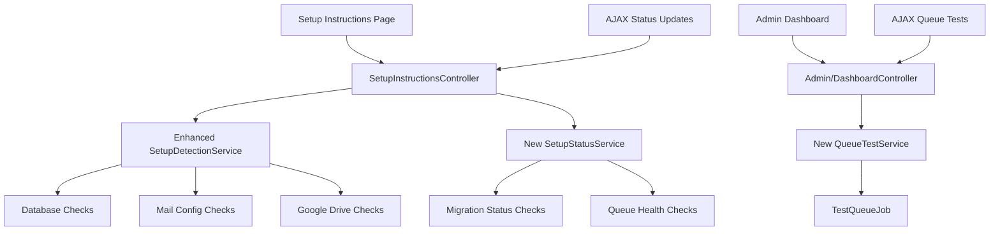

# Design Document

## Overview

This feature enhances the setup instructions page by adding real-time status indicators for each setup step and provides ongoing queue testing functionality in the admin dashboard. The design leverages existing services (`SetupDetectionService`, `SetupService`) and follows Laravel conventions for controllers, services, and frontend components.

The enhancement consists of two main components:
1. **Setup Instructions Status Enhancement**: Real-time status indicators on the setup instructions page
2. **Admin Queue Testing**: Ongoing queue health verification in the admin dashboard

## Architecture

### High-Level Architecture



### Service Layer Architecture

The design extends existing services and adds new specialized services:

- **SetupDetectionService** (existing): Enhanced with migration status checking
- **SetupStatusService** (new): Aggregates all status checks and provides structured responses
- **QueueTestService** (new): Handles queue testing functionality
- **TestQueueJob** (new): Simple job for testing queue processing

## Components and Interfaces

### 1. Enhanced SetupDetectionService

**New Methods:**
```php
public function getMigrationStatus(): bool
public function getQueueHealthStatus(): array
public function getAllStepStatuses(): array
```

**Migration Status Detection:**
- Check for existence of key tables: `users`, `file_uploads`, `jobs`, etc.
- Use `Schema::hasTable()` for reliable detection
- Verify table structure matches expected schema

**Queue Health Detection:**
- Check recent job processing activity
- Count failed jobs in last 24 hours
- Identify stalled jobs
- Return structured status with details

### 2. New SetupStatusService

**Purpose:** Centralized service for aggregating all setup status information

**Key Methods:**
```php
public function getDetailedStepStatuses(): array
public function refreshAllStatuses(): array
public function getStatusSummary(): array
```

**Response Structure:**
```php
[
    'database' => [
        'status' => 'completed|incomplete|error',
        'message' => 'Human readable status',
        'details' => ['specific', 'error', 'details'],
        'checked_at' => '2025-01-01 12:00:00'
    ],
    // ... other steps
]
```

### 3. New QueueTestService

**Purpose:** Handle queue testing functionality for both setup and ongoing monitoring

**Key Methods:**
```php
public function dispatchTestJob(): string // Returns job ID
public function checkTestJobStatus(string $jobId): array
public function getQueueHealthMetrics(): array
public function cleanupOldTestJobs(): void
```

**Test Job Workflow:**
1. Dispatch `TestQueueJob` with unique identifier
2. Store job metadata in cache with timestamp
3. Job performs simple operations (log entry, cache update)
4. Frontend polls for completion status
5. Return success/failure with timing information

### 4. New TestQueueJob

**Purpose:** Simple job for testing queue processing

**Functionality:**
- Log test execution with timestamp
- Update cache with completion status
- Perform basic operations to verify queue worker functionality
- Include configurable delay for testing purposes

## Data Models

### Enhanced Status Response Model

```php
interface SetupStepStatus
{
    public const STATUS_COMPLETED = 'completed';
    public const STATUS_INCOMPLETE = 'incomplete';
    public const STATUS_ERROR = 'error';
    public const STATUS_CHECKING = 'checking';
    public const STATUS_CANNOT_VERIFY = 'cannot_verify';
    
    public function getStatus(): string;
    public function getMessage(): string;
    public function getDetails(): array;
    public function getCheckedAt(): ?Carbon;
}
```

### Queue Test Result Model

```php
class QueueTestResult
{
    public string $jobId;
    public string $status; // pending, processing, completed, failed, timeout
    public ?float $processingTime;
    public ?string $errorMessage;
    public Carbon $dispatchedAt;
    public ?Carbon $completedAt;
}
```

## Error Handling

### Graceful Degradation Strategy

1. **Service Unavailable**: If detection services fail, show "Cannot Check" status
2. **Partial Failures**: Continue checking other steps if one fails
3. **Timeout Handling**: Implement reasonable timeouts for all checks
4. **Cache Fallback**: Use cached results if fresh checks fail

### Error Response Structure

```php
[
    'status' => 'error',
    'message' => 'User-friendly error message',
    'technical_details' => 'Technical error for debugging',
    'retry_suggested' => true|false,
    'fallback_instructions' => 'Manual verification steps'
]
```

### Queue Test Error Handling

- **Job Dispatch Failure**: Clear error message with retry option
- **Job Timeout**: Configurable timeout (default 30 seconds) with clear messaging
- **Worker Not Running**: Detect and provide specific guidance
- **Job Failure**: Capture and display job exception details

## Testing Strategy

### Unit Tests

**SetupDetectionService Tests:**
- Mock database connections for testing database status
- Mock environment variables for configuration tests
- Test migration status detection with various table states
- Test queue health metrics calculation

**SetupStatusService Tests:**
- Test status aggregation logic
- Test caching behavior
- Test error handling and fallback scenarios
- Mock all underlying services

**QueueTestService Tests:**
- Test job dispatch and tracking
- Test timeout handling
- Test cleanup functionality
- Mock queue and cache interactions

### Integration Tests

**Setup Instructions Page:**
- Test AJAX status refresh functionality
- Test visual status indicator updates
- Test error state handling
- Test responsive design on mobile

**Admin Dashboard Queue Testing:**
- Test complete queue test workflow
- Test concurrent test prevention
- Test test result persistence and cleanup
- Test integration with existing admin dashboard

### Feature Tests

**End-to-End Setup Flow:**
- Test complete setup process with status indicators
- Verify status updates as configuration is completed
- Test setup completion detection and redirection

**Queue Testing Workflow:**
- Test queue test from admin dashboard
- Verify test job processing and result reporting
- Test error scenarios (worker down, job failure)

## Frontend Implementation

### Setup Instructions Page Enhancement

**Status Indicator Component:**
```html
<div class="setup-step-status" data-step="database">
    <span class="status-indicator status-completed">
        <svg class="checkmark">...</svg>
        Completed
    </span>
    <div class="status-details">
        Last checked: 2 minutes ago
    </div>
</div>
```

**AJAX Status Refresh:**
- Refresh button triggers status check for all steps
- Individual step refresh capability
- Loading states during checks
- Error state handling with retry options

**CSS Status Classes:**
```css
.status-completed { color: green; }
.status-incomplete { color: orange; }
.status-error { color: red; }
.status-checking { color: blue; }
.status-cannot-verify { color: gray; }
```

### Admin Dashboard Queue Test Component

**Test Interface:**
```html
<div class="queue-test-panel">
    <button id="test-queue-btn" class="btn btn-primary">
        Test Queue Worker
    </button>
    <div id="test-results" class="test-results hidden">
        <!-- Dynamic test results -->
    </div>
</div>
```

**Real-time Updates:**
- WebSocket or polling for test progress
- Progress indicators during test execution
- Success/failure animations
- Historical test results display

## Security Considerations

### Access Control
- Setup status checks: Available during setup phase only
- Admin queue testing: Admin role required
- AJAX endpoints: Proper authentication and CSRF protection

### Information Disclosure
- Limit technical details in error messages for non-admin users
- Sanitize database connection errors
- Avoid exposing sensitive configuration details

### Rate Limiting
- Limit status check frequency to prevent abuse
- Prevent multiple concurrent queue tests
- Implement reasonable timeouts for all operations

## Performance Considerations

### Caching Strategy
- Cache status results for 30 seconds to prevent excessive checks
- Use Redis/database cache for test job tracking
- Implement cache invalidation on configuration changes

### Optimization
- Parallel execution of independent status checks
- Lazy loading of detailed status information
- Efficient database queries for migration status
- Cleanup of old test job records

### Scalability
- Design for multiple admin users testing queue simultaneously
- Consider queue worker scaling scenarios
- Implement proper job cleanup to prevent database bloat

## Implementation Phases

### Phase 1: Core Status Detection
1. Enhance SetupDetectionService with migration and queue checks
2. Create SetupStatusService for status aggregation
3. Add AJAX endpoints to SetupInstructionsController
4. Update setup instructions view with status indicators

### Phase 2: Queue Testing Infrastructure
1. Create QueueTestService and TestQueueJob
2. Add queue testing endpoints to Admin/DashboardController
3. Implement test job tracking and cleanup
4. Add admin dashboard queue test interface

### Phase 3: Frontend Enhancement
1. Implement AJAX status refresh functionality
2. Add real-time queue test progress tracking
3. Enhance visual design and responsive behavior
4. Add error handling and user feedback

### Phase 4: Testing and Polish
1. Comprehensive test coverage
2. Performance optimization
3. Security review
4. Documentation and deployment guides