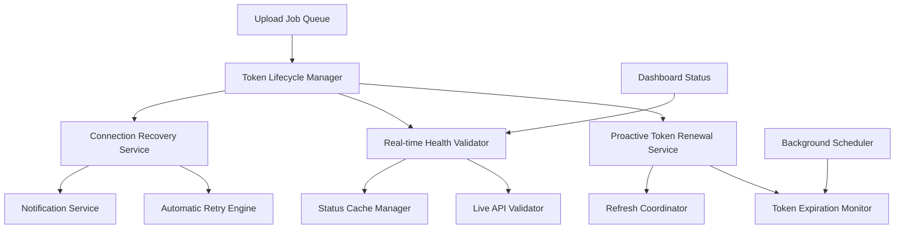

# Google Drive Token Auto-Renewal System - Complete Documentation

## Overview

The Google Drive Token Auto-Renewal System is a comprehensive solution that addresses critical issues with Google Drive token management and health status reporting in the file upload platform. This system ensures seamless token renewal without manual intervention and provides accurate real-time health status reporting.

## Documentation Structure

This documentation is organized into several specialized guides, each targeting specific audiences and use cases:

### 📋 [Deployment Guide](./google-drive-token-auto-renewal-deployment-guide.md)
**Audience**: DevOps Engineers, System Administrators  
**Purpose**: Step-by-step instructions for deploying the token auto-renewal system

**Contents**:
- Pre-deployment checklist and requirements
- Phase-by-phase deployment instructions
- Database migrations and configuration updates
- Post-deployment verification procedures
- Environment-specific configurations
- Success criteria and rollback triggers

### 🔧 [Troubleshooting Guide](./google-drive-token-troubleshooting-guide.md)
**Audience**: Support Engineers, Developers, System Administrators  
**Purpose**: Comprehensive troubleshooting procedures for common and complex issues

**Contents**:
- Token refresh failure diagnosis and resolution
- Health status accuracy issues
- Notification delivery problems
- Queue and background job issues
- Performance optimization
- Emergency response procedures

### 📊 [Monitoring and Alerting Guide](./google-drive-token-monitoring-alerting-guide.md)
**Audience**: DevOps Engineers, Site Reliability Engineers  
**Purpose**: Complete monitoring and alerting setup for the token system

**Contents**:
- Key metrics and thresholds
- Dashboard configuration
- External monitoring integration (Prometheus, Grafana)
- Alerting rules and escalation procedures
- Performance monitoring and optimization
- Health check endpoints

### 👥 [User Guide](./google-drive-token-user-guide.md)
**Audience**: End Users, Administrators  
**Purpose**: Understanding connection status, token information, and notifications

**Contents**:
- Dashboard status indicators explanation
- Token lifecycle and automatic renewal process
- Email notification types and responses
- Troubleshooting common user issues
- Best practices for administrators and clients
- FAQ and support procedures

### 🚨 [Rollback and Recovery Guide](./google-drive-token-rollback-recovery-guide.md)
**Audience**: DevOps Engineers, System Administrators  
**Purpose**: Emergency procedures for rolling back and recovering from failures

**Contents**:
- Emergency response levels and procedures
- Quick rollback procedures (5-minute response)
- Selective feature rollback options
- Database rollback and data recovery
- Service recovery and gradual restoration
- Post-incident analysis and prevention

### ⚙️ [Configuration Reference](./google-drive-token-configuration-reference.md)
**Audience**: Developers, System Administrators  
**Purpose**: Comprehensive reference for all configuration options

**Contents**:
- Environment variable reference
- Configuration file structure
- Environment-specific settings
- Advanced configuration options
- Validation and testing procedures
- Migration between configurations

### 🎨 [Dashboard Widget Examples](./dashboard-token-status-widget-examples.md)
**Audience**: Frontend Developers, UI/UX Designers  
**Purpose**: Visual examples and implementation guide for the enhanced token status widget

**Contents**:
- Widget layout examples for all status states
- Interactive elements and real-time updates
- Mobile responsive design patterns
- Color schemes and accessibility features
- Animation and transition specifications
- Implementation notes and performance considerations

## Quick Start Guide

### For New Deployments

1. **Read the [Deployment Guide](./google-drive-token-auto-renewal-deployment-guide.md)** first
2. **Configure monitoring** using the [Monitoring Guide](./google-drive-token-monitoring-alerting-guide.md)
3. **Set up alerting** for critical metrics
4. **Train your team** on the [Troubleshooting Guide](./google-drive-token-troubleshooting-guide.md)
5. **Prepare rollback procedures** from the [Recovery Guide](./google-drive-token-rollback-recovery-guide.md)

### For Existing Systems

1. **Review current configuration** against the [Configuration Reference](./google-drive-token-configuration-reference.md)
2. **Implement monitoring** if not already in place
3. **Test rollback procedures** in staging environment
4. **Update user documentation** with the [User Guide](./google-drive-token-user-guide.md)

### For Troubleshooting

1. **Check the [Troubleshooting Guide](./google-drive-token-troubleshooting-guide.md)** for your specific issue
2. **Review monitoring dashboards** for system health
3. **Follow diagnostic procedures** step by step
4. **Escalate to rollback** if issues persist

## System Architecture Overview

### Core Components

### Key Features

#### 🔄 Automatic Token Renewal
- Proactive refresh 15 minutes before expiration
- Exponential backoff retry logic
- Mutex locking to prevent duplicate refreshes
- Comprehensive error classification and handling

#### 📊 Real-time Health Validation
- Live API connectivity testing
- Intelligent caching with different TTLs
- Accurate status reporting in dashboard
- Automatic inconsistency detection and correction

#### 📧 Smart Notification System
- Immediate alerts for critical issues
- Throttled notifications to prevent spam
- Multiple notification channels (email, Slack, PagerDuty)
- Escalation to admin when user notifications fail

#### 🔧 Automatic Recovery
- Retry pending uploads after connection restoration
- Self-healing mechanisms for common issues
- Graceful degradation during outages
- Comprehensive audit logging

## Implementation Status

### ✅ Completed Features

- [x] Enhanced GoogleDriveToken model with tracking fields
- [x] TokenRefreshErrorType enum and classification system
- [x] TokenRefreshCoordinator with mutex locking
- [x] Enhanced GoogleDriveService with proactive validation
- [x] ProactiveTokenRenewalService
- [x] RealTimeHealthValidator for accurate status reporting
- [x] Enhanced CloudStorageHealthService
- [x] Email notification system for token renewal failures
- [x] Updated UploadToGoogleDrive job with automatic refresh
- [x] ConnectionRecoveryService for automatic remediation
- [x] Background maintenance jobs for proactive monitoring
- [x] Updated dashboard controllers with live validation
- [x] Comprehensive logging and monitoring
- [x] Rate limiting and security measures
- [x] Integration tests for end-to-end token lifecycle
- [x] Configuration and feature flags for gradual rollout
- [x] Performance optimizations and caching
- [x] Complete documentation and deployment guides

### 🚧 In Progress

- [ ] Enhanced dashboard token status widget (Task 18)

### 📋 Future Enhancements

- Multi-provider token management (Microsoft Teams, Dropbox)
- Advanced analytics and reporting
- Machine learning for predictive token refresh
- Enhanced security features (token rotation, audit trails)

## Key Metrics and Thresholds

### Critical Metrics

| Metric | Target | Warning | Critical |
|--------|--------|---------|----------|
| Token Refresh Success Rate | >95% | <90% | <80% |
| Health Status Accuracy | >98% | <95% | <90% |
| Upload Success Rate | >98% | <95% | <90% |
| Notification Delivery Rate | >98% | <95% | <90% |
| Queue Processing Time | <30s | >60s | >120s |
| Health Validation Latency | <1s | >3s | >5s |

### Performance Benchmarks

- **Token Refresh Latency**: <2 seconds average
- **Health Validation Cache Hit Rate**: >80%
- **Queue Depth**: <10 jobs normal, <50 warning, >100 critical
- **Memory Usage**: <512MB per worker process
- **Database Query Time**: <500ms average

## Security Considerations

### Token Security
- Refresh tokens encrypted at rest using Laravel encryption
- Token rotation on successful refresh
- Rate limiting to prevent abuse (5 attempts per hour per user)
- Comprehensive audit logging for all token operations

### Access Control
- Admin-only access to token management interfaces
- IP-based rate limiting for token refresh endpoints
- Secure storage of Google API credentials
- Regular security reviews and updates

### Data Protection
- No storage of Google passwords or sensitive credentials
- Minimal token data retention (automatic cleanup)
- Encrypted communication with Google APIs
- GDPR-compliant data handling procedures

## Support and Maintenance

### Regular Maintenance Tasks

#### Daily
- Review token refresh success rates
- Check queue performance metrics
- Monitor error logs for new patterns
- Verify notification delivery

#### Weekly
- Analyze performance trends
- Clean up old logs and metrics
- Review alerting thresholds
- Test backup procedures

#### Monthly
- Review Google API quota usage
- Analyze user behavior patterns
- Update monitoring dashboards
- Conduct security reviews

### Support Escalation

#### Level 1: User Issues
- Dashboard status questions
- Upload failures
- Notification concerns
- **Response Time**: 4 hours business hours

#### Level 2: System Issues
- Token refresh failures affecting multiple users
- Performance degradation
- Configuration problems
- **Response Time**: 2 hours business hours

#### Level 3: Critical Issues
- System-wide outages
- Security incidents
- Data integrity issues
- **Response Time**: 30 minutes 24/7

### Getting Help

#### Documentation Resources
1. Start with the appropriate guide based on your role and issue
2. Check the FAQ sections in each guide
3. Review monitoring dashboards for system health
4. Follow diagnostic procedures step by step

#### Support Channels
1. **Self-Service**: Use diagnostic commands and troubleshooting guides
2. **Internal Support**: Contact your system administrator or DevOps team
3. **Escalation**: Follow your organization's incident response procedures

#### Information to Collect
When reporting issues, include:
- Current system status and error messages
- Recent log entries (last 100 lines)
- Steps to reproduce the issue
- Impact assessment (number of affected users)
- Urgency level and business impact

## Version History and Updates

### Version 1.0 (Current)
- Initial release with complete token auto-renewal system
- Real-time health validation
- Comprehensive notification system
- Background maintenance jobs
- Complete documentation suite

### Planned Updates
- Enhanced dashboard widgets (v1.1)
- Multi-provider support (v2.0)
- Advanced analytics (v2.1)
- Machine learning integration (v3.0)

## Contributing and Feedback

### Documentation Updates
- Submit pull requests for documentation improvements
- Report documentation issues or gaps
- Suggest additional troubleshooting scenarios
- Provide feedback on clarity and completeness

### System Improvements
- Report bugs and issues through proper channels
- Suggest feature enhancements
- Contribute performance optimizations
- Share deployment experiences and lessons learned

---

This comprehensive documentation ensures that all stakeholders have the information they need to successfully deploy, operate, and maintain the Google Drive Token Auto-Renewal System. Each guide is designed to be self-contained while linking to related information when needed.